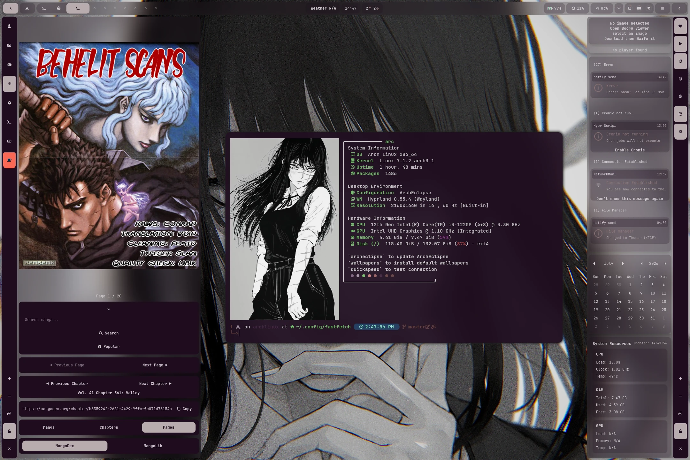
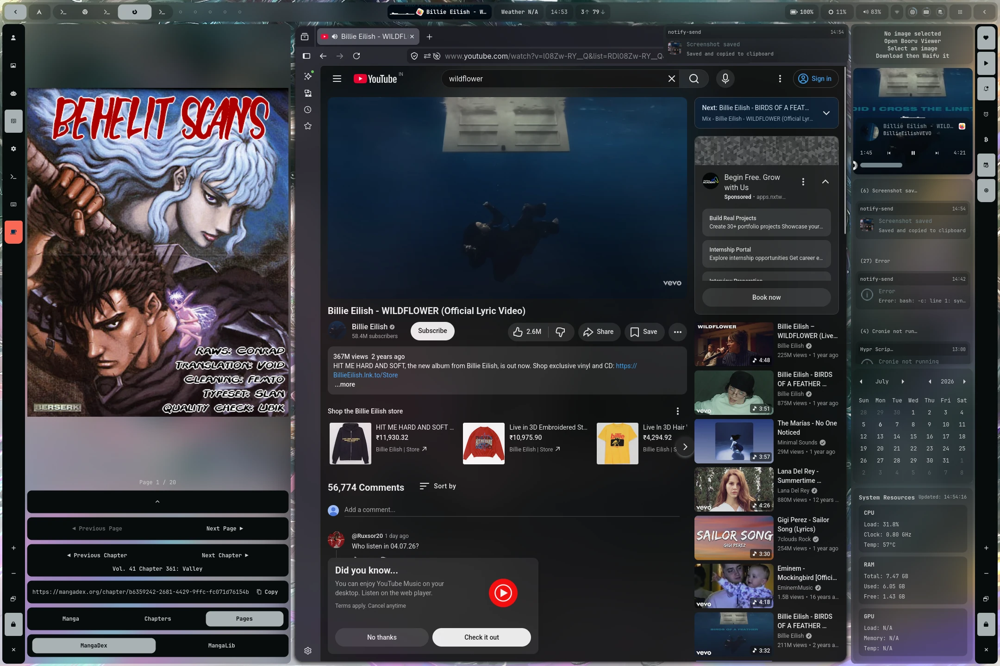
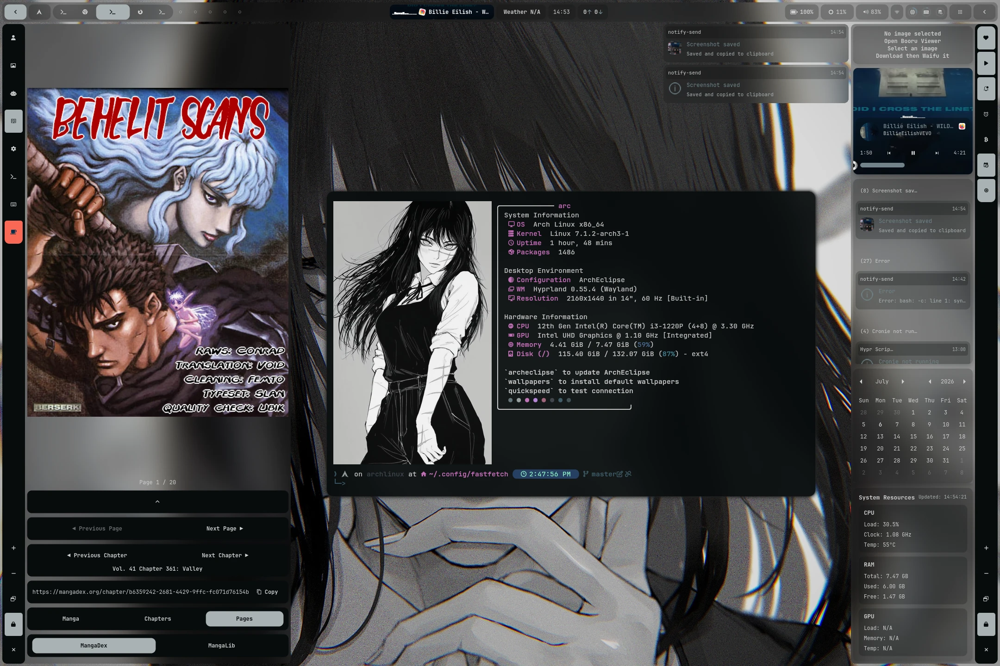
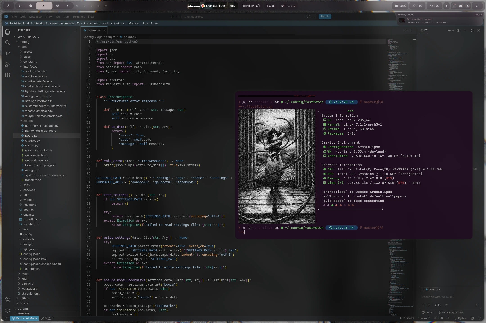
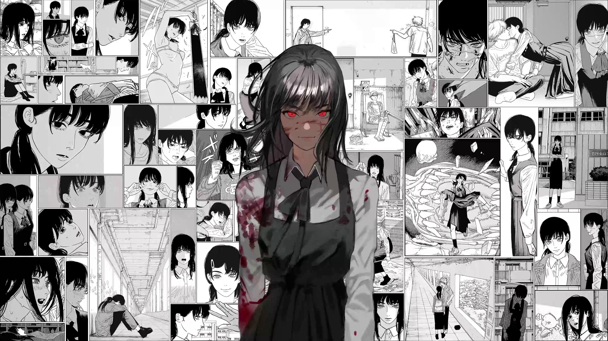

<div align="center">


</div>

<div align="center">


</div>

<br/>

---

## 🖥️ Desktop Preview

Here is a preview of the **Luna-Hyprdots** desktop environment in action, featuring the customized panel widgets, workspaces, and system controls:

<p align="center">
  
  
</p>

<p align="center">
  
  
</p>

---

## 🖼️ Wallpapers Gallery

A collection of high-resolution minimalist and anime wallpapers included in this setup:

<table>
  <tr>
    <td align="center"><br><sub>Wallpaper 1</sub></td>
    <td align="center"><br><sub>Wallpaper 2</sub></td>
    <td align="center"><br><sub>Wallpaper 3</sub></td>
  </tr>
  <tr>
    <td align="center"><br><sub>Wallpaper 4</sub></td>
    <td align="center"><br><sub>Asa Mitaka</sub></td>
    <td align="center"><br><sub>Chainsaw Man Girls</sub></td>
  </tr>
  <tr>
    <td align="center"><br><sub>Yoru (War Devil)</sub></td>
    <td align="center"><br><sub>War Devil Dark</sub></td>
    <td></td>
  </tr>
</table>

---

## 📂 Repository Structure

The full directory layout of the **Luna-Hyprdots** project is organized as follows:

```txt
luna-hyprdots/
├── install.sh                  ← Unified Bash installation wizard
├── LICENSE                     ← GNU GPLv3 License text
├── README.md                   ← Project documentation
├── .zshrc                      ← Pre-configured Zsh shell environment
├── .gitignore                  ← Git file inclusion/exclusion rules
├── 📁 DOCUMENTATION/           ← Modular manuals & troubleshooting guides
│   ├── README.md
│   ├── 00_DOCUMENTATION.md
│   ├── 01_ANIMATIONS.md
│   ├── 02_KEYBINDINGS.md
│   └── ...
├── 📁 .icons/                  ← Cursor icons (Phinger dark/light themes)
└── 📁 .config/                 ← Configuration files (copied to ~/.config/)
    ├── starship.toml           ← Starship prompt configuration
    ├── 📁 ags/                 ← Aylur's GTK Shell (bars, widgets, panels)
    ├── 📁 cava/                ← Audio visualizer configurations
    ├── 📁 fastfetch/           ← Fastfetch desktop details config
    ├── 📁 hypr/                ← Hyprland, Hyprlock, and Hyprpaper setup
    ├── 📁 kitty/               ← Kitty terminal emulator profile
    ├── 📁 pipewire/            ← Audio management routing configurations
    ├── 📁 showcase/            ← Webp screenshots for GitHub preview
    └── 📁 wallpapers/          ← Wallpapers directory (SFW images)
```

---

## ✨ Features

- **Advanced Status Bar & Widgets**: Powered by Aylur's GTK Shell (AGS) for fully customizable status bar panels, app launchers, user profile widgets, and dashboard toggles.
- **Dynamic Wallpapers & Themes**: Dynamic wallpaper picker with animated transitions using `swww` and automated configuration updates.
- **Unified Clean Installer**: A simple one-command bash installer script (`install.sh`) that installs dependencies, sets up user permissions, and deploys dotfiles safely.
- **Minimalist Structure**: Clear separation between components, ensuring configuration files remain clean, manageable, and easy to tweak.

---

## 🚀 Installation

### 1️⃣ Clone the Repository
```bash
git clone https://github.com/Arunachalam-gojosaturo/luna-hyprdots.git
cd luna-hyprdots
```

### 2️⃣ Run the Installer
```bash
chmod +x install.sh
./install.sh
```

---

## 🤝 Inspiration & Credits

> [!NOTE]
> This Hyprland configuration is inspired by the exceptional work and structural organization in [ArchEclipse by AymanLyesri](https://github.com/AymanLyesri/ArchEclipse). Thank you for the contribution to the Linux customization community!

---

## 👤 Author

<div align="center">


### **Arunachalam**
*Linux Customization Enthusiast*

[](https://github.com/Arunachalam-gojosaturo)
[](https://instagram.com/saturogojo_ac)

</div>

---

## 📄 License

This project is licensed under the **GNU General Public License Version 3 (GPLv3)**. See the [LICENSE](LICENSE) file for details.
